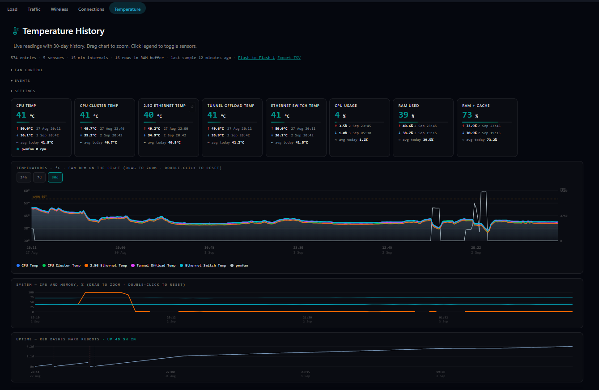
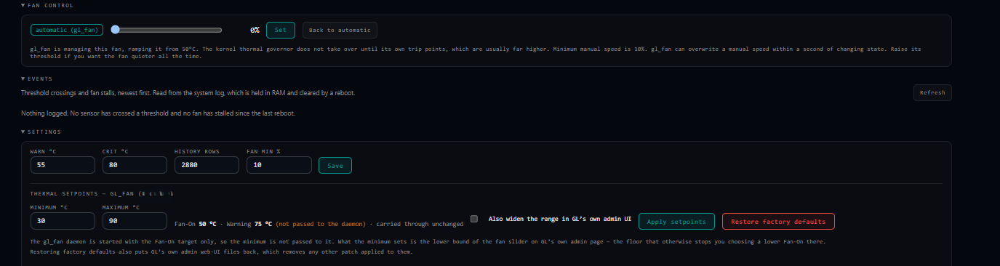
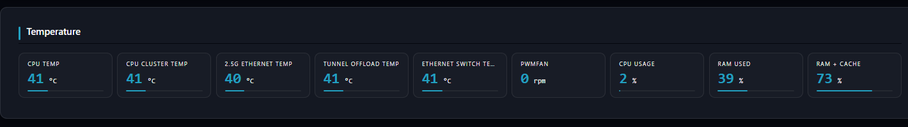

# luci-app-temp-history

Long-term temperature and fan monitoring for OpenWrt, as a LuCI page.

Every router exposes thermal sensors and throws the readings away. This keeps
them: a reading every 15 minutes, 30 days of history, and a daily summary that
is never discarded — so you can answer *"is this router hotter than it was six
months ago?"* rather than only *"is it hot now?"*

Readings are buffered in RAM and written to flash **once a day**, which is the
difference between ~35 000 flash writes a year and ~365.

Works on **OpenWrt 21.02 and newer**, including builds with no `ucode`.



---

## What you get

**A history page** under *Status → Temperature*: a live card per sensor with
today's min, max and average; a 30-day chart you can drag to zoom; per-sensor
legend toggles; an uptime strip that marks reboots.

**Fan monitoring**, where the hardware has a tachometer — RPM collected in the
same pass as the temperatures, on the same chart axis. A fan reporting **0 rpm
reads as `0 rpm`, never as "no data"**: unlike a temperature, zero is a real
and important measurement.

**Manual fan control**, where the hardware has a writable PWM. A speed you set
expires on its own (30 minutes by default) and is handed straight back to the
kernel if any sensor reaches your critical threshold, if the guard process
dies, or on reboot. There is a minimum-speed floor so the page cannot be used
to stall the fan.

**Thermal setpoints on GL.iNet firmware.** Where the fan is run by GL's
`gl_fan` daemon rather than the kernel governor, the Settings panel can set its
**minimum** and **maximum** setpoints and restore the factory defaults. The
maximum lifts the stock 90 °C ceiling — up to 120 °C, with a confirmation past
90. Hidden entirely on every other router. See
[Thermal setpoints](#thermal-setpoints-glinet-firmware).

**CPU and memory**, live and over 30 days, on a fixed 0-100 % axis next to the
temperature series — so *it was hot* can be told apart from *it was hot and
working*. See [CPU and memory](#cpu-and-memory).

**Watchdogs for the failures that are otherwise silent:**

| Condition | What happens |
|---|---|
| Fan driven at ≥25 % duty reporting 0 rpm for two samples | syslog error, banner naming the fan |
| No sample recorded for ~40 minutes | banner saying how old the data is, and to check `crontab -l` |
| A sensor crossing your warn/crit threshold | syslog line — crossings and recoveries only, never repeats |
| Sensor or fan map no longer matching the recorded columns | banner, and the next flush rotates the old file aside |

**A Status Overview widget** with a card per sensor and per fan. Its bars and
readings take their colour from the active theme — read from a real LuCI
progressbar at runtime rather than hardcoded — so they match whatever theme the
router is wearing. The warm and critical colours stay fixed, because those
carry meaning.

**Configuration from the page**: warn and critical temperatures, how many rows
to keep, the minimum manual fan speed, and the GL.iNet setpoints above.
Everything else lives in `/etc/config/temp_history`.

The three panels above the cards — fan control, the event log, and settings —
are collapsed until you want them:



And the Status Overview widget, on the front page next to everything else:



---

## Install

Grab the release for your package manager and install it. The package is
architecture-independent, so one file fits every target.

```sh
# OpenWrt 25.12+ (apk)
apk add --allow-untrusted ./luci-app-temp-history_1.0.0-r1_noarch.apk

# OpenWrt 21.02 - 24.10 (opkg)
opkg install ./luci-app-temp-history_1.0.0-1_all.ipk
```

Then open *Status → Temperature*. The first reading is taken immediately; the
chart fills in over the following hours.

To reinstall the *same* version with apk, remove it first — `apk` has no
`--force-reinstall` (that was apk-tools 2):

```sh
apk del luci-app-temp-history && apk add --allow-untrusted ./luci-app-temp-history_1.0.0-r1_noarch.apk
```

### Build it yourself

From a checkout, with no OpenWrt SDK:

```sh
sh tools/build-ipk.sh          # -> dist/
```

Or in an SDK tree, the usual way:

```sh
cp -r luci-app-temp-history <sdk>/package/
cd <sdk> && make package/luci-app-temp-history/compile V=s
```

---

## How it works

```
  cron */15                         cron 01:05 (or the UI button)
      │                                   │
      ▼                                   ▼
  collect-temp-history.sh            flush-temp-history.sh
      │  reads sysfs                      │  RAM ──► flash
      │  writes /tmp buffers              │  rotates on layout change
      │  watchdogs ──► syslog             │  builds the daily rollup
      ▼                                   ▼
  /tmp/*-buf.log ────────────────►  /root/website/*.tsv
                                          │
                     ┌────────────────────┴───────────────────┐
                     ▼                                        ▼
            ubus (authenticated)                   get-temp-history.cgi
       luci.temp-status  (ucode, 22.03+)            read-only JSON + TSV
       luci.temp-history (shell, all)                       │
                     └────────────────┬───────────────────  ┘
                                      ▼
                            Status → Temperature
```

### Files on the router

| Path | What it is |
|---|---|
| `/root/website/temp-sensors.conf` | discovered sensor map — path and name per column |
| `/root/website/fan-sensors.conf` | discovered fan map — tachometer, name, PWM, PWM-enable |
| `/root/website/temp-history.tsv` | 15-minute series, capped by `max_rows` |
| `/root/website/fan-history.tsv` | fan RPM series |
| `/root/website/sys-history.tsv` | CPU % and the two memory figures |
| `/root/website/uptime-history.tsv` | uptime, for reboot detection |
| `/root/website/temp-daily.tsv` | daily min/max/mean per sensor — **never trimmed** |
| `/etc/config/temp_history` | configuration (a conffile: upgrades keep your edits) |
| `/root/website/glfan-baseline/` | GL.iNet only, and only on a device with no `/rom`: the one-time factory snapshot |
| `/usr/libexec/temp-history/` | collector, flush, fan control, setpoints, setup |

Both series carry a **schema header** naming the source of each column
(`#th1` for temperatures, `#fh1` for fans). Before appending, the header is
compared against the live map; if they differ the old file is rotated aside
rather than appended to, because mixing two column layouts in one file
silently corrupts every historical row with no way to tell afterwards which
rows meant what.

### Sensors

Discovery runs once, on first collection: every `hwmon*/temp*_input`, plus any
`thermal_zone*` not already covered by an hwmon device. It is deliberately
**not** re-run automatically — a new map can have a different column count,
which would misalign every historical row. To rebuild it after a kernel
upgrade renumbers your hwmon devices:

```sh
rm /root/website/temp-sensors.conf
/usr/libexec/temp-history/collect-temp-history.sh
```

Sensor names are yours to change: edit the second column of
`temp-sensors.conf`. Lines starting with `#` are skipped, so a sensor can be
commented out without shifting the columns after it.

---

## Configuration

```sh
uci show temp_history
```

| Option | Default | Meaning |
|---|---|---|
| `warn_temp` | 65 | amber on the cards, dashed line on the chart, syslog notice on crossing |
| `crit_temp` | 80 | red, syslog **error**, and the fan failsafe threshold |
| `max_rows` | 2880 | rows kept in the 15-minute series (2880 = 30 days) |
| `cgi_write` | auto | who may flush/reset over the unauthenticated CGI — see below |
| `fan_control` | 1 | 0 disables manual fan control entirely |
| `fan_min_percent` | 25 | floor for a manual speed, so the page cannot stall the fan |
| `fan_override_minutes` | 30 | how long a manual speed lasts before the kernel takes over |
| `glfan_ui_patch` | 0 | GL.iNet only: also rewrite GL's admin web-UI bundles — see below |
| `glfan_min` / `glfan_max` | — | written by the page: the setpoint band last applied |

`warn_temp`, `crit_temp`, `max_rows` and `fan_min_percent` are editable from
the Settings panel on the page, as are the GL.iNet setpoints. `cgi_write`
deliberately is not: it is a security setting, not a preference.

### Choosing `fan_min_percent`

25 is a conservative default, **not a measurement of your fan**. A PWM fan
needs more duty to start from a standstill than to keep turning, so the number
that belongs here is the lowest duty that reliably *restarts* it. Walk it down
and watch:

```sh
uci set temp_history.main.fan_min_percent=5; uci commit temp_history
for p in 30 20 15 10 5; do
  /usr/libexec/temp-history/fan-control.sh set $p 2 >/dev/null
  sleep 8
  printf '%3s%% -> %s rpm\n' $p "$(cat /sys/class/hwmon/hwmon0/fan1_input)"
done
/usr/libexec/temp-history/fan-control.sh auto
```

Where the RPM stops falling as the percentage falls, the fan has reached its
own floor and lower settings buy nothing. Then test the restart: set 0, wait
for it to stop, and set your candidate — if it spins up, that is your number.

---

## Security

Everything under `/www/cgi-bin` is served by uhttpd with **no LuCI session
behind it**. That shapes the whole design:

- **Reads** go through the CGI. It serves sensor data and history, nothing
  else, and sets no CORS headers — same-origin only.
- **Writes** (flush, reset min/max, fan control) go over **ubus**, which LuCI
  authenticates: `luci.temp-status` (a ucode plugin, OpenWrt 22.03+) and
  `luci.temp-history` (an rpcd *shell* plugin, which works on 21.02 too).
- **Fan control has no CGI route at all.** Writing `pwm_enable` is not
  something an unauthenticated endpoint should be able to do.
- **Events have no CGI route either**, and for a reason that is about reading
  rather than writing: `getEvents` returns lines from the **system log**, which
  is the one place on a router where unrelated daemons write text nobody
  audited. Serving that from an unauthenticated endpoint would be a window into
  the whole machine, not just into this app.
- The CGI's `?flush=1` / `?reset=N` are a **break-glass route**, and honest
  about it: with `cgi_write=auto` (the default) they refuse whenever either
  ubus object answers — i.e. whenever rpcd is working. They open only if rpcd
  is dead, which is also when you could not have logged into LuCI to reach
  them. `cgi_write=0` shuts them permanently.

A raw CGI under `/www/cgi-bin` **cannot** see the LuCI session, by two
independent mechanisms — uhttpd forwards only a fixed allowlist of request
headers to CGI scripts, and LuCI scopes its session cookie to
`path=/cgi-bin/luci`. Both are worth knowing before trying to bolt
authentication onto a CGI; the answer is to move the operation to rpcd.

---

## Fan control and other controllers

Some firmware runs its own fan daemon. GL.iNet's `gl_fan`, for example, polls a
thermal zone once a second and drives the same PWM. Where the package finds
one, the fan panel names it and reports its start threshold, because it will
overrule a manual speed within a second of changing state.

The package **reports** such a daemon and never stops it: below the kernel's
own emergency trip points it may be the router's entire thermal protection.

Drivers with no `pwmN_enable` (the mainline `pwm-fan`, for one) cannot be
disengaged from the kernel thermal governor at all. A manual speed is written
straight to `pwm` and may be overwritten whenever the governor next acts; the
page says so rather than presenting a setting that silently reverts.

---

## CPU and memory

A **System** box below the fan chart: three live tiles updated on the
60-second poll, and a 15-minute history chart on a fixed 0-100 % axis beside
the temperature series, so *it was hot* can be told apart from *it was hot and
working*.

**CPU is a delta, not a reading.** `/proc/stat` counts jiffies since boot, so a
percentage only exists relative to an earlier sample. The history line is the
average utilisation across each 15-minute window — the same window the
temperature next to it was measured in, which is the whole point. Brief spikes
average away; the live tiles are what catch those.

The baseline lives in `/tmp` on purpose: the counters reset at boot and so does
`/tmp`, so a reboot can never produce a delta against a pre-reboot baseline.
The cost is that the first sample after a reboot reads `—` rather than a
nonsense spike.

**Two memory figures, because neither is honest alone on Linux.** *RAM* is
`MemTotal - MemAvailable`, which is what memory pressure actually means. *RAM +
cache* is `MemTotal - MemFree`, which is what most tools show and which sits
near full on any healthy router, because a kernel with spare memory caches with
it. The second only means something next to the first.

Recorded in its own `sys-history.tsv` — nothing about the temperature series
changes, and a router that has never collected any simply gets no box.

## Thermal setpoints (GL.iNet firmware)

On GL.iNet stock firmware the fan is regulated by `gl_fan` against a set of
temperature setpoints, and on at least one board the kernel's own trip points
start at 85 °C — so below that, `gl_fan` is the entire thermal control. Telling
it to start the fan earlier is a different operation from overriding the PWM
for half an hour, and the Settings panel now offers both.

| Setpoint | What it does | Editable here |
|---|---|---|
| Minimum | where the fan starts, at its lowest duty. Higher keeps it off longer | **yes** |
| Fan-On | the target `gl_fan` ramps toward | no — shown, carried through |
| Warning | what the firmware logs and colours against | no — shown, carried through |
| Maximum | the top of the range. Stock firmware caps this at 90 °C | **yes**, to 120 |

> **What the minimum actually does, and why you want it.** `gl_fan` is started
> by an init script that builds its command line out of UCI and reads only the
> options it names. On GL.iNet firmware 4.9.1 those are `enabled`,
> `sysfs`, `div`, `temperature` and the PID gains — `minimum_temperature` is
> not among them, and the daemon runs as `gl_fan -T <zone> -D 1000 -t 75`.
>
> So the minimum never reaches the process. What it *does* set is the **lower
> bound of the fan slider on GL's own admin page**:
>
> ```js
> minimumTemperature(){const{minimum_temperature:t}=this.softwareFeature;return Number(null!=t?t:70)}
> attrs:{min:t.minimumTemperature-1, ...}
> handleInpSlider(t){ ... t<this.minimumTemperature&&(this.temperature=this.minimumTemperature)}
> ```
>
> That 70 is a *fallback*, not a hard floor — which is the reason GL's slider
> starts at 70 °C and snaps back if you drag lower.
>
> **Confirmed on GL.iNet firmware 4.9.1:** setting
> `glfan.globals.minimum_temperature=55` in UCI and hard-reloading GL's admin
> page moves the slider to 55–90 and updates its info line, with **no bundle
> patching whatsoever**. GL's page reads that value from its own feature
> payload, so the system half is the whole solution for widening the floor.
> Leave `glfan_ui_patch` at 0.
>
> Patching `gl_util.sh` as well — which the system half also does — is what
> makes it survive `fan_init` re-provisioning, since `fan_init` otherwise
> writes its hardcoded `local minimum_temperature=70` back into UCI.
>
> The **maximum** is the one thing that genuinely needs the web-UI patch:
> `maximumTemperature:()=>90` is a literal in the bundle with no UCI input. If
> 55–90 is enough range for you, you never need to enable it.

Fan-On and Warning are carried through unchanged and clamped into the new band
only when the band would otherwise exclude them — `Minimum ≤ Fan-On ≤ Maximum`
has to hold or `gl_fan`'s own comparisons stop meaning anything. When a value
is moved, the page says which one.

**Above 90 °C the page asks first.** Most silicon is rated to around 105 °C;
past that you are choosing throttling or an emergency shutdown over fan noise.

### Two halves, and why only one is on by default

| | What it touches | Default |
|---|---|---|
| System | `uci glfan.globals.*`, `/lib/functions/gl_util.sh` | always applied |
| Web UI | `/www/js/app.*.js.gz`, the overview view bundle, the i18n strings | `glfan_ui_patch=0` |

The system half is what changes cooling. The web-UI half rewrites GL's own
minified admin bundles so *its* slider shows the widened range; it changes
nothing about the fan, it is undone by any firmware upgrade, and it is the
risky half. Turn it on only if you also drive the fan from GL's admin page,
where an un-widened slider snaps a setpoint above 90 back down.

```sh
uci set temp_history.main.glfan_ui_patch=1; uci commit temp_history
```

### Every change starts from the factory files

The substitutions match pristine firmware text — `-lt 6[0-9]`,
`attrs:{min:…,max:…}` — and are **not idempotent**: run against an
already-patched file they either match nothing and silently leave a stale
value, or match the wrong thing. So each change restores the baseline first and
patches that.

The baseline is `/rom`, the read-only firmware image, which every GL.iNet
firmware has. On a device booted without an overlay there is none, and the
package falls back to a copy taken **once**, before it first touched the files.
That is honestly weaker — if something else had already patched `gl_util.sh`,
that state becomes "factory" — so the page says which baseline is in use. With
neither, a change is **refused** rather than compounded.

**Restoring factory defaults puts back GL's admin web-UI files too**, whatever
the checkbox says, because some other tool may have patched them. Anything
else that modified them — a third-party script injecting a button into GL's
admin UI, say — has to be re-applied by whatever put it there.

### Check before you change anything

Every substitution in this feature was written against one person's firmware
and is a bet that yours has the same text. **A bet that loses is not loud**: a
`sed` that matches nothing exits 0 and changes nothing, so a setpoint would
look applied while `gl_fan` kept its old value.

```sh
/usr/libexec/temp-history/glfan-setpoints.sh check 55 100
```

Read-only — it writes nothing outside a scratch directory in `/tmp`, touches
no UCI and does not restart anything. It reports, measured on *your* firmware:

- which expressions match and **which match nothing** (flagged `MISS`),
- a real diff of what `gl_util.sh` would become, produced by running the same
  function that would write for real,
- every match of the app-bundle validator expression with context, and a
  verdict on whether it is safe to apply (see below),
- whether your live files still match `/rom`, which tells you whether an
  earlier tool's "reset to defaults" actually restored,
- the thermal zones, their trip points and the cooling device.

Worth re-running after a firmware upgrade, not just once. It works before the
package is installed, so you can copy the single script to the router and run
it there first:

```sh
scp root/usr/libexec/temp-history/glfan-setpoints.sh root@192.168.8.1:/tmp/
ssh root@192.168.8.1 'sh /tmp/glfan-setpoints.sh check 55 100'
```

### From the shell

```sh
/usr/libexec/temp-history/glfan-setpoints.sh status
/usr/libexec/temp-history/glfan-setpoints.sh check 55 100   # read-only
/usr/libexec/temp-history/glfan-setpoints.sh set 55 100
/usr/libexec/temp-history/glfan-setpoints.sh reset
```

### The app-bundle validator, and why it is guarded

The upstream script widens a global validator in `app.*.js.gz` with

```
s/[0-9]\{1,3\}||i<[0-9]\{2,3\}/<min>||i<<max+1>/g
```

That is a **shape, not a name**: any two small integers either side of `||i<`.
On GL.iNet firmware 4.9.1 the only thing it matches in the whole bundle
is

```
90===i||270===i?t-=e/2:(i>270||i<90)&&(t-=e)
```

— text rotation, 270 and 90 **degrees**. Applied globally that corrupts
unrelated rendering in GL's admin UI, silently, and gains nothing: the two
neighbouring `temperature:NN` expressions match nothing on that firmware
either.

So this port applies it only when **every** match sits within 40 characters of
the word "temperature". Otherwise the app bundle is left untouched and the
reason goes to syslog. The decision is per file, not per occurrence —
rewriting some matches and not others would need `awk` over a single
multi-megabyte minified line, and a partial rewrite is a worse failure than
none. `check` prints the same verdict before anything is written.

### One thing `check` will tell you about your board

If `/lib/functions/gl_util.sh` has no `case` label matching your model, the
port falls back to rewriting **every** `local minimum_temperature=` /
`local temperature=` in the file, with no model scope — other models' values
included. That is usually harmless, since only your board's branch runs, but
it also means the model detection failed and the values you asked for may be
landing in a branch that never executes. `check` says so, prints the
assignments and lists the case labels so you can compare.

After a change that patched the web UI, hard-reload GL's admin page
(Ctrl/Cmd-Shift-R) — a plain reload serves the cached bundle.

---

## Troubleshooting

**"No data yet" that never changes.** Nothing collects if cron is not running,
and cron is one of the first services stripped from a minimal build:

```sh
/etc/init.d/cron enable && /etc/init.d/cron restart
crontab -l | grep temp-history
```

If the crontab is empty, put it back without reinstalling:

```sh
/usr/libexec/temp-history/setup.sh install
```

**Every sensor reads 0.0.** The map is stale, usually after a kernel upgrade
renumbered the hwmon devices. The collector warns about this hourly in
`logread`. Rebuild the map as shown under *Sensors* above.

**The page and the router disagree.** The Settings panel shows the version of
the page you are looking at, and turns amber if the router is running a
different one — that is a cached page, so reload with Ctrl-Shift-R.

**Check what the router thinks is happening:**

```sh
logread -e temp-history                                   # watchdog events
/usr/libexec/temp-history/fan-control.sh status           # fan state as JSON
GATEWAY_INTERFACE=CGI/1.1 REQUEST_METHOD=GET QUERY_STRING="" \
  /www/cgi-bin/get-temp-history.cgi | tr -d '\r' | sed '1,/^$/d' | head -c 400
```

That last one needs the `tr -d '\r'`: the CGI ends its headers with CRLF, so
the blank separator line is `\r` and a plain `sed '1,/^$/d'` deletes the whole
payload.

---

## Tests

The suite is **not published** — it lives outside this repository, alongside
the fixtures and firmware transcripts it needs. Around 577 checks: shell
suites against simulated sysfs and firmware trees, the frontend under jsdom,
the ucode backend against a real ucode interpreter, and a linter for two awk
mistakes that pass on a development machine and fail on a router.

Two things it takes seriously, both learned the hard way:

- **Test doubles must reproduce the real thing's behaviour, not its
  documentation.** A jsdom stub that quietly dropped `null` children let the
  suite pass while the page printed the word "null" three times.
- **Assert what the user sees.** Checking that the right request went out is
  not the same as checking that the button reported success.

---

## Changelog

See [CHANGELOG.md](CHANGELOG.md).

## Licence

GPL-3.0-or-later. See [LICENSE](LICENSE).
